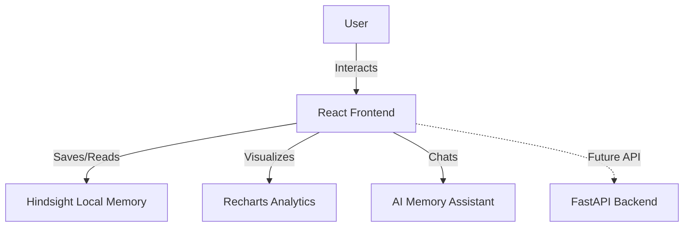

# ScrapSense AI

ScrapSense AI is a next-generation, AI-powered enterprise resource planning (ERP) dashboard built specifically for the scrap business and recycling industry. It offers a premium Microsoft-style Glassmorphism UI, real-time analytics, and an integrated Hindsight Memory AI assistant.

## Features

- **Hindsight AI Memory**: Automatically logs, analyzes, and learns from every purchase and supplier interaction.
- **Smart AI Recommendations**: Get dynamic risk levels, pricing trends, and recommended buying ranges for specific suppliers.
- **Natural Language Assistant**: Chat with your data! Ask complex questions about previous purchases, quality history, and outstanding balances.
- **Enterprise Reports & Analytics**: Instantly generate financial, brand, and supplier performance reports with Recharts data visualization.
- **Supplier Management**: Track supplier quality scores, payment statuses, and deep historical logs.
- **Modern Glassmorphism UI**: Beautiful, fully responsive interface built with React and Tailwind CSS. Dark mode supported.

## Architecture Diagram



## Tech Stack

- **Frontend**: React 18, TypeScript, Vite
- **Styling**: Tailwind CSS (Glassmorphism, Dark/Light modes)
- **Icons**: Lucide React
- **Charts**: Recharts
- **State Management**: React Context, LocalStorage (Persistent Hindsight Memory)
- **Backend (API Ready)**: FastAPI, Python, SQLite/PostgreSQL

## Installation

1. Navigate to the `frontend` directory:
   ```bash
   cd frontend
   ```
2. Install dependencies (make sure you install newly added packages):
   ```bash
   npm install
   # or yarn / pnpm install
   ```
3. Start the Vite development server:
   ```bash
   npm run dev
   ```

## Demo Credentials

The application includes a fully functional frontend mock authentication system. Use the following credentials to access the dashboard:

- **Email**: `admin@scrapsense.ai`
- **Password**: `admin123`

*Once logged in, realistic demo data for suppliers and purchases is automatically seeded into your local browser storage.*

## Hackathon Ready
This project is presentation-ready for the Microsoft Hackathon, featuring a stunning premium UI, isolated local state architecture for flawless demoing without a backend, and complete AI insight workflows!
